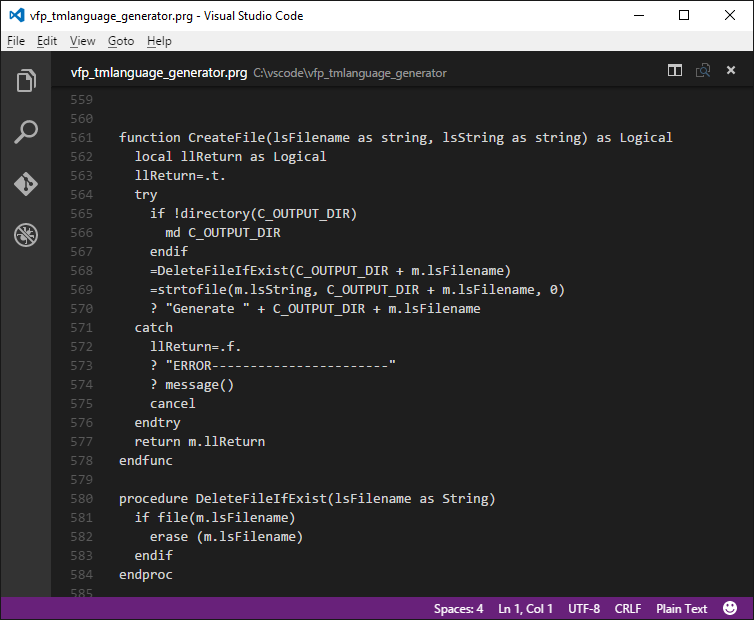
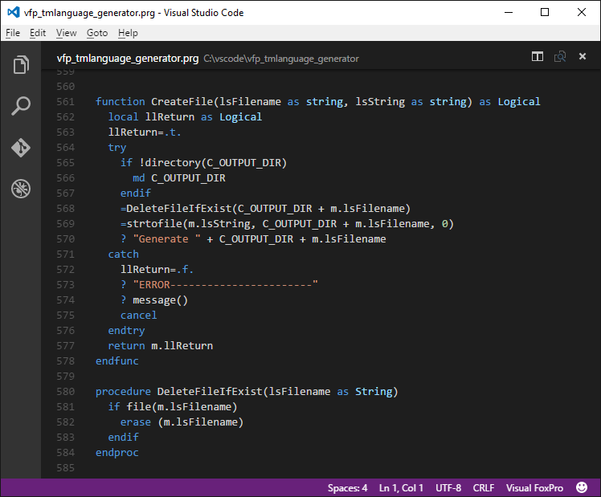
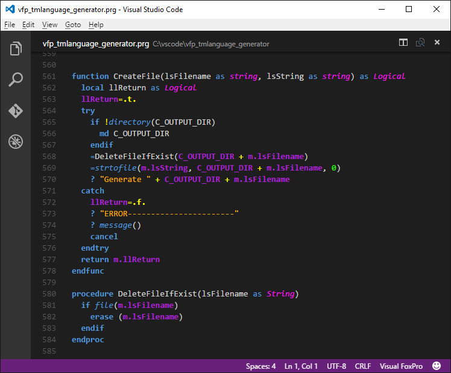

# A **Visual FoxPro** language extension for **Visual Studio Code**

* Microsoft Visual Studio Code website: https://code.visualstudio.com/


## VFP Code in VS Code

* When you open a PRG file in vs Code, you see :



## VFP Syntax highlighting (Colorization)

* Download [vfp_tmlanguage_generator.prg](https://github.com/FrancisFaure/vfp_tmlanguage_generator), run in vfp9, and click "Ok" to install.

Now you see (vs Code "Dark Theme") :



## Personalized Color Theme (for VFP Extension)

* If you want have more colors or personalize your theme: [take a look at...](https://github.com/FrancisFaure/vfp_tmtheme_generator)

Download [vfp_tmtheme_generator.prg](https://github.com/FrancisFaure/vfp_tmtheme_generator), personalize, run in vfp9, and click "Ok" to install.

After, you can see :




## VFP9 integration

For use VS Code as external editor in VFP for commands: "MODIFY COMMAND" and "MODIFY FILE"
Update you config.fpw file
``` 
TEDIT=/N C:\Program Files (x86)\Microsoft VS Code\Code.exe
```


## Uninstall

**vfp_tmlanguage_generator.prg** : create a uninstaller script file : **"vfp_tmlanguage\uninstall vfp language.cmd"**
* who contains:
```
rd /S/Q %USERPROFILE%\.vscode\extensions\vfp\
```
(or remove %USERPROFILE%\.vscode\extensions\vfp\ with Windows explorer)


## License

[MIT](LICENSE) &copy; Francis FAURE


** Enjoy! **