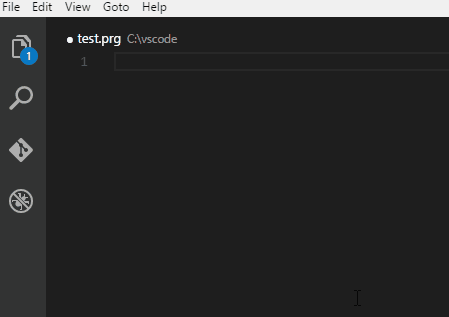
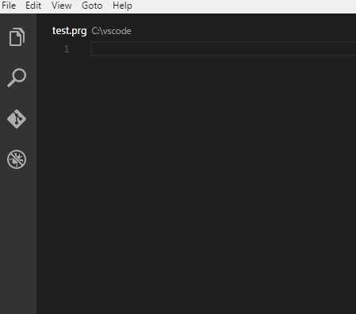
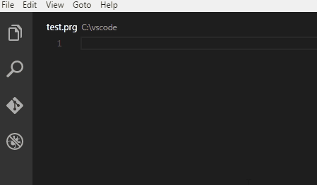
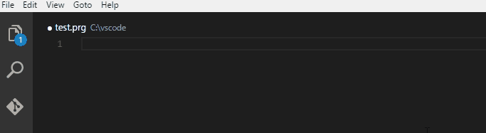
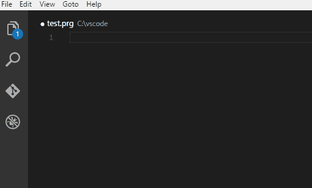

# **Visual FoxPro** Snippets :

## VFP Language for VS Code

* Microsoft Visual Studio Code website: https://code.visualstudio.com/
* Visual FoxPro language Extension website: [GitHub](https://github.com/FrancisFaure/vfp_tmlanguage_generator)
* Visual FoxPro Theme website: [GitHub](https://github.com/FrancisFaure/vfp_tmtheme_generator)

## License

[MIT](LICENSE) &copy; Francis FAURE
